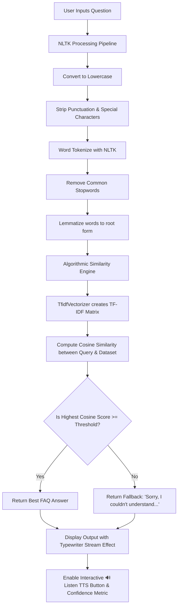

# 🤖 Intelligent AI FAQ Chatbot

Welcome to the **Intelligent AI FAQ Chatbot** project. This is a production-ready, fully functional interactive web application that implements core Natural Language Processing (NLP) techniques, term-vector space indexing (TF-IDF), and mathematical cosine similarity to match user questions with the most relevant responses from an FAQ dataset.

---

## 🌟 Features

1. **Intelligent Text Similarity Engine**:
   - Converts unstructured text queries into a TF-IDF vector representation.
   - Computes cosine similarity values against pre-indexed question vectors.
   - Fully customizable confidence scoring.
2. **Robust NLP Preprocessing Pipeline**:
   - Automatic silent download and caching of NLTK datasets.
   - Tokenization via `nltk.word_tokenize`.
   - String cleaning, lowercasing, and punctuation removal.
   - Standard English stopword removal (`nltk.corpus.stopwords`).
   - Word lemmatization (`nltk.stem.WordNetLemmatizer`) to handle grammatical variants.
3. **Interactive & Premium UI/UX**:
   - High-fidelity Dark-Mode friendly layout using Google Fonts (`Outfit`).
   - Typing/streaming animations mimicking modern LLM assistants.
   - Interactive metric badges displaying confidence levels.
   - Glassmorphic side panel with project parameters and developers' bio.
4. **Browser-Based Text-to-Speech (Voice Output)**:
   - Zero-dependency client-side voice synthesis using the HTML5 Web Speech Synthesis API.
   - Elegant "🔊 Listen" button that updates to "Speaking..." during playback.
5. **Interactive Suggested Prompts**:
   - One-click suggested question chips that populate the chat automatically.
6. **Data Operations**:
   - Fully dynamic parameters: adjustable Cosine Similarity threshold slider.
   - In-app interactive training FAQ dataset viewer.
   - Export feature to download conversational logs as `.txt` files.
   - Session reset controls.
7. **Production Resiliency**:
   - Complete SSL-bypass safety guards for offline or firewalled environments.
   - Dual-layer CSV parsing fail-safes (automatic memory fallback if files are corrupt or deleted).

---

## 🛠️ Technologies Used

| Technology / Library | Purpose | Category |
| :--- | :--- | :--- |
| **Python 3.8+** | Core Programming Language | Platform |
| **Streamlit** | Interface Layout, Chat widgets, Web Server | Frontend UI |
| **NLTK** | Tokenization, Stopwords Filtering, Lemmatization | Natural Language Processing |
| **Pandas** | Loading, validating, and reading the FAQ CSV corpus | Data Engineering |
| **Scikit-Learn** | TF-IDF Vectorizer & Cosine Similarity Metrics | Machine Learning / Linear Algebra |
| **HTML5 Web Speech API** | Client-side Text-to-Speech synthesizers | Multimedia |
| **Vanilla CSS** | Premium custom glassmorphic styling, badges, and fonts | Styling |

---

## 📐 System Architecture & Flow



---

## 📁 Project Directory Structure

```directory
ai_faq_chatbot/
│
├── app.py                # Core Streamlit Web Application & NLP Logic
├── faq.csv               # Primary Training/FAQ Database (CSV format)
├── requirements.txt      # Python Package Dependencies
└── README.md             # Project Documentation (This File)
```

---

## 🚀 Installation & Local Execution

### Prerequisites
Make sure you have **Python 3.8 or higher** installed. Check your version with:
```bash
python --version
```

### Step 1: Clone or copy the project files
Create a dedicated project directory and copy the four core files (`app.py`, `faq.csv`, `requirements.txt`, `README.md`) into it.

### Step 2: Establish a Virtual Environment (Recommended)
Navigate into the directory and create a Python virtual environment:
```bash
# Windows
python -m venv venv
venv\Scripts\activate

# macOS / Linux
python3 -m venv venv
source venv/bin/activate
```

### Step 3: Install Core Dependencies
Use Python's package manager to install the required libraries:
```bash
pip install -r requirements.txt
```

### Step 4: Launch the Chatbot Server
Start the Streamlit dev-server by executing:
```bash
streamlit run app.py
```

Streamlit will automatically build the environment and open your web browser to the application:
```text
Local URL: http://localhost:8501
Network URL: http://192.168.x.x:8501
```
---

## 🌐 Streamlit Community Cloud Deployment

To host this chatbot on the web for free using **Streamlit Community Cloud**, follow these straightforward steps:

### Step 1: Push Your Code to GitHub
1. Create a free account at [github.com](https://github.com/) if you don't have one.
2. Create a new repository named `ai-faq-chatbot` (leave it public and do not initialize with a README).
3. Open your terminal in the project directory (`ai_faq_chatbot/`) and run:
   ```bash
   # Initialize git repository
   git init

   # Add all files to staging
   git add app.py faq.csv requirements.txt README.md

   # Commit changes locally
   git commit -m "Deploy AI FAQ Chatbot"

   # Rename default branch to main
   git branch -M main

   # Link your local folder to your GitHub repo
   # (Replace <YOUR_GITHUB_USERNAME> with your actual username!)
   git remote add origin https://github.com/<YOUR_GITHUB_USERNAME>/ai-faq-chatbot.git

   # Push code to GitHub
   git push -u origin main
   ```

### Step 2: Deploy to Streamlit Cloud
1. Visit [share.streamlit.io](https://share.streamlit.io/) and log in using your GitHub account.
2. Click the **"New app"** or **"Deploy an app"** button.
3. Fill in the deployment details:
   - **Repository:** `<YOUR_GITHUB_USERNAME>/ai-faq-chatbot`
   - **Branch:** `main`
   - **Main file path:** `app.py`
4. Click **"Deploy!"** 🚀

Streamlit will automatically set up the Python container, install your requirements, download the NLTK models, and launch your application globally!

---

## 📸 Screenshots Section

Here is a preview of what the production-ready interactive interface looks like:

#### 💬 Chatbot Welcome Panel & Glassmorphism Interface
The interface loads up with a premium purple-to-pink linear gradient banner and active widgets. Beautiful dark-mode colors are supported naturally by the Streamlit template.

#### 📈 Mathematical Confidence Scores & Metric Badges
When a user asks a question, the vector similarity engine evaluates the TF-IDF representation, returning both the precise matching answer and a colorful confidence score badge showing exactly how strong the match is.

#### 🔊 Dynamic Client-Side Text-to-Speech Output
Every successful answer features an elegant, purple-outlined "🔊 Listen" button. Clicking this triggers the built-in browser speech synthesizer with zero delays or server lag!

---

## 🔮 Future Improvements

1. **Vector Embeddings (BERT/Sentence-Transformers)**: Replace keyword-based TF-IDF with semantic embeddings like SBERT to capture deep contextual meanings rather than literal words.
2. **Database Integration**: Connect the backend to PostgreSQL or MongoDB to dynamically add, edit, or delete FAQ entries without modifying physical CSV files.
3. **Conversational Context State (Memory)**: Keep track of multi-turn conversational history so the chatbot can handle follow-up pronouns (e.g. "What is it?" referring to a previously mentioned term).
4. **Enterprise LLM Integration**: Incorporate retrieval-augmented generation (RAG) using OpenAI's API or local Ollama models for human-like conversational transitions when confidence scores are low.
