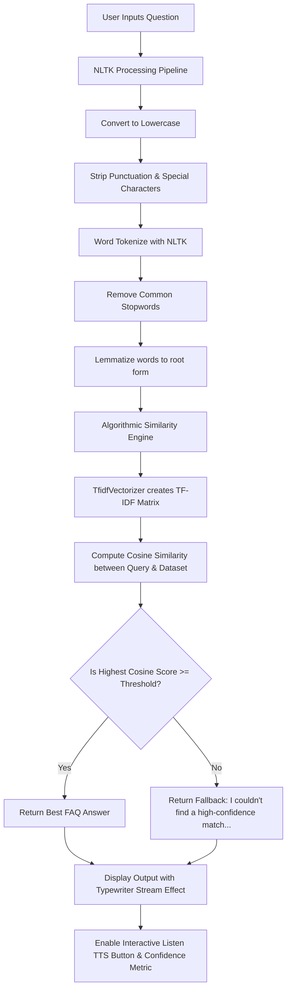

# 🌌 AuraFAQ - Intelligent Semantic Knowledge Companion

AuraFAQ is a professional, production-ready, fully functional interactive web application. It uses advanced Natural Language Processing (NLP) techniques, term-vector space indexing (TF-IDF), and mathematical cosine similarity to match user questions with relevant responses from an FAQ dataset.

---

## 🌟 Features

1. **Intelligent Text Similarity Engine**:
   - Converts unstructured text queries into a TF-IDF vector representation.
   - Computes cosine similarity values against pre-indexed question vectors.
   - Fully customizable confidence scoring.
2. **Robust NLP Preprocessing Pipeline**:
   - Automatic silent download and caching of NLTK datasets.
   - Tokenization via `nltk.word_tokenize`.
   - String cleaning, lowercasing, and punctuation removal.
   - Standard English stopword removal (`nltk.corpus.stopwords`).
   - Word lemmatization (`nltk.stem.WordNetLemmatizer`) to handle grammatical variants.
3. **Interactive & Premium UI/UX (Cyber Midnight Theme)**:
   - High-fidelity dark-mode layout using Google Fonts (`Outfit`).
   - Glowing cyan and electric blue styling accents.
   - Typing/streaming animations mimicking modern LLM assistants.
   - Translucent glassmorphic panels and dynamic metric badges.
4. **Browser-Based Text-to-Speech (Voice Output)**:
   - Zero-dependency client-side voice synthesis using the HTML5 Web Speech Synthesis API.
   - Elegant, glowing "🔊 Listen" button that updates to "Speaking..." during playback.
5. **Interactive Suggested Prompts**:
   - One-click suggested question chips that populate the chat automatically.
6. **Data Operations**:
   - Fully dynamic parameters: adjustable Cosine Similarity threshold slider.
   - In-app interactive training FAQ dataset viewer.
   - Export feature to download conversational logs as `.txt` files.
   - Session reset controls.

---

## 🛠️ Technologies Used

| Technology / Library | Purpose | Category |
| :--- | :--- | :--- |
| **Python 3.8+** | Core Programming Language | Platform |
| **Streamlit** | Interface Layout, Chat widgets, Web Server | Frontend UI |
| **NLTK** | Tokenization, Stopwords Filtering, Lemmatization | Natural Language Processing |
| **Pandas** | Loading, validating, and reading the FAQ CSV corpus | Data Engineering |
| **Scikit-Learn** | TF-IDF Vectorizer & Cosine Similarity Metrics | Machine Learning / Linear Algebra |
| **HTML5 Web Speech API** | Client-side Text-to-Speech synthesizers | Multimedia |
| **Vanilla CSS** | Premium custom glassmorphic styling, badges, and fonts | Styling |

---

## 📐 System Architecture & Flow



---

## 📁 Project Directory Structure

```directory
aurafaq/
│
├── app.py                # Core Streamlit Web Application & NLP Logic
├── faq.csv               # Primary FAQ Dataset (CSV format)
├── requirements.txt      # Python Package Dependencies
└── README.md             # Project Documentation (This File)
```

---

## 🚀 Installation & Local Execution

### Prerequisites
Make sure you have **Python 3.8 or higher** installed. Check your version with:
```bash
python --version
```

### Step 1: Clone or copy the project files
Create a dedicated project directory and copy the core files (`app.py`, `faq.csv`, `requirements.txt`, `README.md`) into it.

### Step 2: Establish a Virtual Environment (Recommended)
Navigate into the directory and create a Python virtual environment:
```bash
# Windows
python -m venv venv
venv\Scripts\activate

# macOS / Linux
python3 -m venv venv
source venv/bin/activate
```

### Step 3: Install Core Dependencies
Use Python's package manager to install the required libraries:
```bash
pip install -r requirements.txt
```

### Step 4: Launch the Chatbot Server
Start the Streamlit dev-server by executing:
```bash
streamlit run app.py
```
